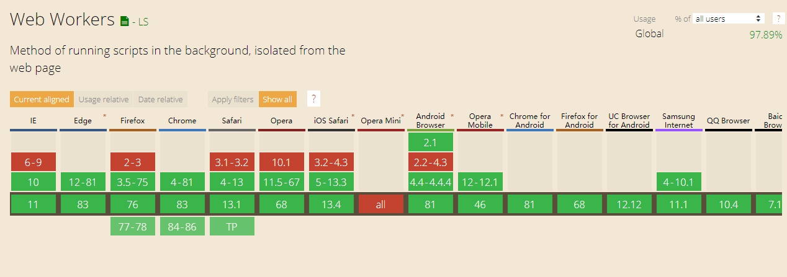

## Web Worker学习记录
&emsp;&emsp;在之前学习H5新特性的过程中，有了解到 `Web Worker` ,发现它可以作为性能优化的一种方式来使用，因此将关于 `Web Worker` 的学习过程记录下来。  
>概念：  
&emsp;&emsp;在实际开发的过程中，经常会遇到需要对类似网络请求返回的数据进行处理，当计算量比较大时，可能会导致UI界面的用户响应处于短暂的‘真空’状态，造成不好的用户体验，这也是由于JavaScript的单线程运行环境所导致的。作为H5新规范中的新特性， `Web Worker` 的规范中定义了两类工作线程：`专用线程、共享线程`，所谓`专用线程即只能被指定用于某个页面，而共享线程则可以被多个页面共享使用`  

>用途：  
&emsp;&emsp;数据处理  
&emsp;&emsp;图像(canvas)处理  
&emsp;&emsp;流媒体（音视频等）数据解析等

>使用：  
&emsp;&emsp;`new Worker('worker.js')`  
&emsp;&emsp;worker,js即需在worker线程内运行的js脚本,也可通过`URL.createObjectURL()`创建URL对象的方式来实现创建内嵌的worker  

>数据通信：  
&emsp;&emsp;worker线程同页面主线程之间的通信基于事件监听机制，通过 `postMessgae()` 和 `onmessage()` 来实现数据的发送和接收,写到这里，突然想起React Native中主页面和内嵌H5页面的通信方式 `react-native-webview` 也正是基于这一机制。此外，还可以通过`可转让对象`的方式来传递数据，即`将一个可转让对象由一个上下文转移至另一个上下文`，需注意的是一旦转让，则原先上下文的对象将不再存在  
&emsp;&emsp;注：页面主线程同worker线程间的数据通信不涉及引用的传递，仅仅是单纯的数据传递，即两线程中各自对传递的数据进行修改不影响另一线程中的数据。传递的数据需经过`序列化和反序列化`处理  

&emsp;示例代码如下：  

    /*专用线程*/
    //主页面（main.js）
    const worker = new Worker('worker.js');
    worker.postMessage([1, 2, 3]);
    worker.onmessage = (event) => {
      //监听到来自worker线程的数据通信(event.data)
    }  
    worker.onerror = () => {
      //错误处理
    }
    //主线程使用专用线程时的错误处理
    worker.onmessageerror = () => {
      //错误处理
    }

    //worker线程(worker.js)
    postMessage({
      name: ''Ferris,
      sex: 'boy'
    })
    addEventListener('messgae', (event) => {
      //接收来自主线程的数据通信
    })
    等价于
    onmessage = (event) => {
      //接收来自主线程的数据通信
    }
    onerror = () => {
      //错误处理
    }

    /*共享线程*/
    //共享线程和专用线程的区别在于专用线程的port会在线程创建时自动设置，并且不会暴露出来。共享线程在传递消息前port必须处于打开状态
    //主页面(main.js)
    const sharedWorker = new SharedWorker('sharedWorker.js');
    sharedWorker.port.onmessage = (event) => {
      //接收来自共享线程传递的数据
    }
    shraedWorker.port.postMessage([1, 2, 3])
    或者
    sharedWorker.port.addEventListener('message', (event) => {
      //接收来自共享线程的数据
    }, false)
    sharedWorker.port.start()

    //sharedWorker线程(sharedWorker.js)
    //sharedWorker线程中需要通过[onconnect]事件来监听端口变化
    onconnect = (event) => {
      let port = event.ports[0];
      port.onmessage = (event) +> {
        //接收来自主页面传递的数据
      }
      port.postMessage([1, 2, 3])
    }

>worker上下文：  
&emsp;&emsp;worker执行上下文的顶层对象为 `WorkerGlobalScope` ,在该环境下可使用的API/属性包括：  
&emsp;&emsp;&emsp;&emsp;setTimeout()/clearTimeout()/setInteval()/clearInterval()  
&emsp;&emsp;&emsp;&emsp;XMLHttpRequest对象、navigator对象、location对象（只读）  
&emsp;&emsp;Worker API：  
&emsp;&emsp;&emsp;&emsp;importScripts()&emsp;&emsp;//用于加载外部脚本（多个脚本时用逗号隔开）  
&emsp;&emsp;&emsp;&emsp;close()&emsp;&emsp;//关闭当前线程  
&emsp;&emsp;&emsp;&emsp;terminate()&emsp;&emsp;//可用于在主线程中关闭worker线程  

>浏览器支持情况：  
&emsp;&emsp;
&emsp;&emsp;[查看Web Workers最新](https://caniuse.com/#feat=webworkers)  
&emsp;&emsp;  
&emsp;&emsp;[查看Shared Web Workers最新](https://caniuse.com/#feat=webworkers)   

&emsp;&emsp;  
参考链接：  
1.https://juejin.im/post/59c1b3645188250ea1502e46  
2.https://zhuanlan.zhihu.com/p/25184390  
3.https://juejin.im/post/5c10e5a9f265da611c26d634#heading-20