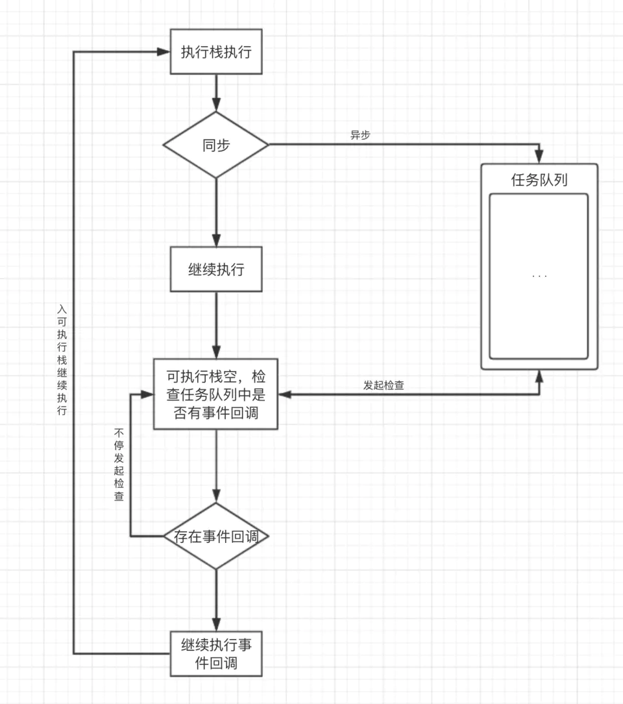
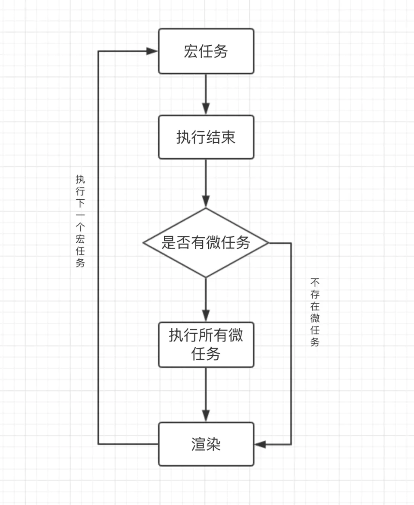

## 浏览器中的JavaScript运行机制（Event Loop）

>1.进程与线程
&emsp;&emsp;(1)进程
&emsp;&emsp;a.定义：进程是CPU资源分配的最小单位
&emsp;&emsp;b.进程包括运行中的程序和程序运行所需要用到的内存和系统资源
&emsp;&emsp;c.CPU使用`时间片轮转调度算法`来实现同时运行多个进程（某一时刻CPU只会运行一个进程）
&emsp;&emsp;(2)线程
&emsp;&emsp;a.定义：线程是CPU调度的最小单位
&emsp;&emsp;b.线程是建立在进程的基础上的一次程序运行单位，即线程就是程序中的一个执行流
&emsp;&emsp;c.一个进程中只有一个执行流称为单线程，即程序执行时，所走的程序路径按照连续顺序排下来，由前到后，只有前面的处理完了才会执行后面的进程
&emsp;&emsp;d.一个进程中有多个执行流时称为多线程，即程序中可以同时运行多个不同的线程来执行不同的任务（允许单个程序创建多个并行执行的线程来完成各自的任务）
&emsp;&emsp;(3)进程与线程的区别：
&emsp;&emsp;a.进程是CPU分配系统资源的最小单位，线程是程序执行的最小单位；
&emsp;&emsp;b.一个进程可由单个或多个线程组成，可将线程理解为一个进程中代码的不同执行路线；
&emsp;&emsp;c.进程之间相互独立，但同一进程下的各个线程之间共享进程的内存空间及进程级的资源；
&emsp;&emsp;d.线程上下文切换比进程更快
&emsp;&emsp;(4)多进程与多线程
&emsp;&emsp;a.多进程指同一时间内一个计算机系统中允许两个及以上的进程处于运行状态（如敲代码的时候看电影或听歌）
&emsp;&emsp;b.多线程即一个进程（程序）中存在多个执行流（在一个程序中同时运行多个不同的线程来执行不同的任务）

>2.JS是单线程的
&emsp;&emsp;js作为浏览器的脚本语言，主要用来同用户进行交互以及操作DOM，所以只能是单线程。否则多个线程同时操作一个DOM或执行某个动作将会引发问题。H5 中Web Worker的出现并非改变了JS单线程的本质，只是为了提升多核CPU的计算能力，允许JS创建多个线程，但子线程是完全受控于主线程的，并且子线程不能操作DOM

>3.浏览器
&emsp;&emsp;(1)浏览器是多进程的（即每打开一个页面就会产生一个进程）
&emsp;&emsp;(2)浏览器包含的进程有：
&emsp;&emsp;a.Browser进程（浏览器的主进程，该进程只有一个）
&emsp;&emsp;&emsp;&emsp;A.负责浏览器界面的显示以及与用户的交互等
&emsp;&emsp;&emsp;&emsp;B.负责各个tab页面的管理，创建和销毁其他进程
&emsp;&emsp;&emsp;&emsp;C.将渲染进程得到的内存中的Bitmap（即位图）绘制到用户界面上
&emsp;&emsp;&emsp;&emsp;D.网络资源的管理、下载等
&emsp;&emsp;b.第三方插件进程
&emsp;&emsp;&emsp;&emsp;A.每个类型的插件对应一个进程，当使用该插件时创建
&emsp;&emsp;c.GPU进程（用于3D绘制等等）
&emsp;&emsp;d.渲染进程
&emsp;&emsp;&emsp;&emsp;A.即浏览器内核（渲染进程内部是多线程的）
&emsp;&emsp;&emsp;&emsp;B.每个tab页面都有一个渲染进程，相互之间互不影响
&emsp;&emsp;&emsp;&emsp;C.主要用于页面渲染、脚本执行、事件处理等
&emsp;&emsp;(3)浏览器多进程的原因：
&emsp;&emsp;常见的如若为单进程，如果某个tab页面崩溃，则会导致整个浏览器无法使用，同样的道理也适用于某个插件进程崩溃
&emsp;&emsp;(4)渲染进程
&emsp;&emsp;a.页面的渲染、脚本的执行，事件的处理等都是在渲染进程中执行
&emsp;&emsp;b.渲染进程是多线程的，主要包括：
&emsp;&emsp;&emsp;&emsp;A.GUI渲染线程
&emsp;&emsp;&emsp;&emsp;&emsp;&emsp;负责浏览器页面的渲染
&emsp;&emsp;&emsp;&emsp;&emsp;&emsp;&emsp;&emsp;解析HTML代码为DOM树
&emsp;&emsp;&emsp;&emsp;&emsp;&emsp;&emsp;&emsp;解析CSS代码为CSSOM（CSS规则树）
&emsp;&emsp;&emsp;&emsp;&emsp;&emsp;&emsp;&emsp;整合DOM树和CSSOM，生成Rendering Tree（渲染树）
&emsp;&emsp;&emsp;&emsp;&emsp;&emsp;当页面发生重绘和回流时，GU线程执行，绘制页面（回流成本高于重绘，应当尽量避免两者）
&emsp;&emsp;&emsp;&emsp;&emsp;&emsp;GUI渲染线程同JS引擎线程是互斥的（即JS引擎执行时，GUI线程会暂停执行，直到JS引擎空闲）
&emsp;&emsp;&emsp;&emsp;B.JS引擎线程（如Google 的V8引擎）
&emsp;&emsp;&emsp;&emsp;&emsp;&emsp;JS引擎线程即JS内核，负责解析处理JS脚本，运行代码
&emsp;&emsp;&emsp;&emsp;&emsp;&emsp;一个Tab页面的渲染进程中始终只有一个js线程来运行JS程序
&emsp;&emsp;&emsp;&emsp;&emsp;&emsp;GU渲染进程和JS引擎进程是互斥的，JS引擎进程会阻塞GUI渲染进程
&emsp;&emsp;&emsp;&emsp;C.事件触发线程
&emsp;&emsp;&emsp;&emsp;&emsp;&emsp;用于控制事件循环，同时管理着一个事件队列
&emsp;&emsp;&emsp;&emsp;&emsp;&emsp;当JS脚本执行时遇到事件绑定或定时器、鼠标点击、ajax请求等时，会通过事件触发线程将对应的时间添加到对应的线程中（如定时器线程），等异步事件有了结果，便将回调操作添加到事件队列，等到JS引擎线程空闲时处理
&emsp;&emsp;&emsp;&emsp;&emsp;&emsp;当某个事件符合触发条件时，事件触发进程会将事件添加到待处理队列的队尾，等待JS引擎处理
&emsp;&emsp;&emsp;&emsp;D.定时器触发线程
&emsp;&emsp;&emsp;&emsp;&emsp;&emsp;setInteval和setTimeout所在线程
&emsp;&emsp;&emsp;&emsp;&emsp;&emsp;因此浏览器的定时计数由该线程负责，而非由JS引擎负责（js引擎是单线程，若被阻塞则会导致计数错误）
&emsp;&emsp;&emsp;&emsp;&emsp;&emsp;通过定时器触发线程来计时并触发定时，计时完毕后，添加到事件触发线程，等待JS引擎线程来执行
&emsp;&emsp;&emsp;&emsp;&emsp;&emsp;W3C的HTML标准中规定setTimeout中低于4ms的时间间隔按4ms来计算
&emsp;&emsp;&emsp;&emsp;E.异步HTTP请求线程
&emsp;&emsp;&emsp;&emsp;&emsp;&emsp;XMLHttpReques在连接后通过浏览器开启一个线程请求（即将异步请求事件添加到异步请求进程）
&emsp;&emsp;&emsp;&emsp;&emsp;&emsp;当请求状态变更（即HTTP状态变化）时，若有对应的状态变更回调函数，则会产生状态变更事件，会将回调事件放入事件触发队列等待JS引擎执行

>4.事件循环（Event Loop）
&emsp;&emsp;(1)JS分为同步任务和异步任务
&emsp;&emsp;&emsp;&emsp;a.同步任务在主线程即JS引擎线程上执行，会形成一个执行栈（先进后出）
&emsp;&emsp;&emsp;&emsp;b.主线程之外，事件触发线程管理着一个任务队列，当异步任务有了运行结果后，会将对应任务的回调函数房屋任务队列中
&emsp;&emsp;&emsp;&emsp;c.当执行栈中的同步任务执行完毕后，会去读取任务队列，将可运行的异步任务（即任务队列中的回调函数，若存在）添加到执行栈中，开始执行
>5.何为事件循环（Event Loop）-- 如何描述（同步、异步任务维度）
如图所示：

`首先，JS脚本里面区分同步任务和异步任务，同步任务会在主线程即JS引擎线程中执行，会形成一个执行栈。当遇到一个JS脚本时，会按照代码顺序依次执行，遇到同步任务直接执行；遇到异步任务时，如setTimeout或setInterval时，会将其移交给定时器触发线程，在约定的计时完成后，会将该异步的定时任务的回调函数放入事件触发线程所管理的事件队列中等待JS引擎执行，当遇到如ajax的异步HTTP请求时，会将其移交给异步HTTP请求线程，当请求完成时，将请求结果（状态）对应的回调函数防御事件触发线程所管理的事件队列中等待JS引擎执行；当主线程执行栈中的同步任务执行完毕后，JS引擎线程开始向事件触发线程发起询问，询问其线程中的事件队列中是否有回调函数需要执行，若有，则将此时在事件队列中的回调函数加入执行栈，接下来便开始执行回调函数，若没有，则JS引擎线程会不断轮询直至有新的事件添加到执行栈中为止，这就形成了所谓的事件循环（Event Loop）`

>6.宏任务（marcrotask或task）& 微任务（microtask或jobs）
&emsp;&emsp;(1)宏任务-即每次执行栈中执行的代码（包括每次从事件队列中获取到一个事件回调函数并放入到执行栈中执行），每个宏任务都会从头到尾执行直至执行完毕，中途不会执行其他。
&emsp;&emsp;&emsp;&emsp;a.常见的宏任务包括如下：
&emsp;&emsp;&emsp;&emsp;&emsp;&emsp;主代码块即单个JS脚本文件代码块
&emsp;&emsp;&emsp;&emsp;&emsp;&emsp;setTimeout()
&emsp;&emsp;&emsp;&emsp;&emsp;&emsp;setInterval()
&emsp;&emsp;&emsp;&emsp;&emsp;&emsp;Node中的setImmediate()
&emsp;&emsp;&emsp;&emsp;&emsp;&emsp;浏览器中的requestAnimationFrame()
&emsp;&emsp;&emsp;&emsp;b.由于JS引擎线程和GUI渲染线程是互斥的，为确保宏任务和DOM任务有序进行，因此两者的执行规则是：`宏任务-->GUI渲染-->宏任务...`
&emsp;&emsp;(2)微任务-ES6中引入了Promise标准，同时浏览器的实现上多了一个microtask微任务，在ECMAScript中也被称为jobs
&emsp;&emsp;&emsp;&emsp;a.有了微任务的概念后，三者的执行规则是：`宏任务-->微任务（宏任务执行期间产生的所有微任务）-->GUI渲染-->宏任务...`
如图所示：

常见的微任务包括如下：
&emsp;&emsp;Node中的process.nextTick()【vue源码中也存在nextTick函数】？
&emsp;&emsp;Promise.then()
&emsp;&emsp;catch
&emsp;&emsp;finally
&emsp;&emsp;Object.observe
&emsp;&emsp;MutationObserver

>7.何为事件循环（Event Loop）【包含同步、异步任务；宏任务、微任务】
如图所示：

`从整体角度（即同步、异步任务，宏任务、微任务）来分析，当JS脚本开始执行时（即第一个宏任务开始执行时），会将js代码分为同步任务和异步任务，同步任务会直接进行主线程（即JS引擎线程）的执行栈中依次执行；异步任务会进一步细分为宏任务和微任务，宏任务进入对应的事件处理线程（如定时器处理线程、异步HTTP请求线程）中，并在其中注册回调函数，当任务执行完成时，会将对应回调函数加入到宏任务队列中；微任务也会进入到对应的事件处理线程中，并在其中注册回调函数，当任务执行完成时，也会将对应的回调函数加入到微任务队列中，当主线程内的任务执行完毕（即执行栈为空时），JS引擎线程处于空闲状态，会首先检查微任务队列，若存在任务，则将当前宏任务执行期间产生的全部微任务加入到执行栈中，依次执行直至全部执行完毕。若没有，则先执行GUI渲染线程，然后继续执行下一个宏任务，如此重复，就形成了所谓的事件循环机制（Event Loop）`

参考链接：
1.[JS运行机制](https://juejin.im/post/5e22b391f265da3e204d8c14)
2.[前端面试之道之EventLoop](https://juejin.im/book/5bdc715fe51d454e755f75ef/section/5be04a8e6fb9a04a072fd2cd)    
3.[前端新能优化原理与实践之EventLoop](https://juejin.im/book/5b936540f265da0a9624b04b/section/5bb1815c6fb9a05d2d0233ad)