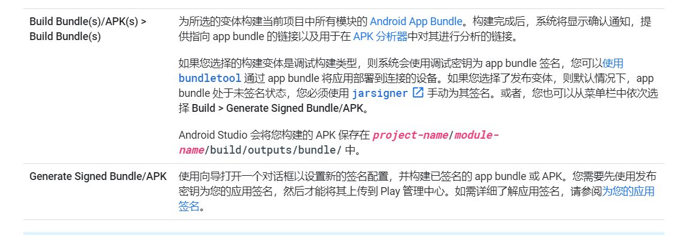
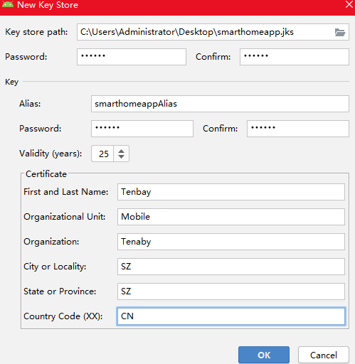
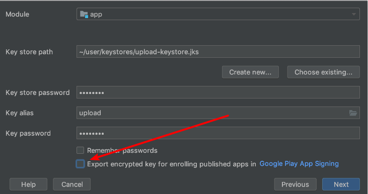

## Android App Bundle打包
>问题：目前智能家居项目打包出来的apk包体积过大，上架google play时提示可采用aab的形式进行app的资源打包上传，因此记录下研究Android App Bundle的过程  

>1：首先自然是从官网找相关资料，aab的定义是：`Android App Bundle 是一种全新的上传格式，其中包含您应用的所有编译好的代码和资源，但 APK 生成及签名工作则交给 Google Play 来处理`，因此可以理解为相比apk形式的打包，一次将所有编译好的代码和资源打包成apk文件供用户下载安装，这时很多并不适用用户当前设备的各种dp密度的图片文件、语言文件不同指令集的so等均在该apk文件中被用户下载到手机上，这部分其实是不必要的。Android App Bundle就是用于解决这个问题的，开发者只需要将应用包含的所有编译好的代码及资源以aab的形式上传到Google Play,之后用户下载该app时，Google Play会根据用户当前的设备型号，动态打包生成符合当前设备的apk包，从而下载到用户手机上的是经过优化的apk，在apk体积上有明显的的缩小。同时，开发者还可以向应用项目添加动态模块功能，并将其包含在app bundle中。除用户首次下载并安装应用时的基本组件之外，其余的所有其他功能和资源都可以包含在这些模块中。使用 Play 核心库，该应用日后可以请求将这些模块下载为动态功能 APK。通过 Dynamic Delivery，Google Play 只会将该模块的代码和资源提供给设备。  

>2:了解完相关概念，接下来就是如何打包aab文件，需满足的前提条件是`Andorid Studio的版本需升级至3.2及以上版本`，接下来就可以开始构建aab项目啦，通过`Build -> Build Bundle(s)/APKS(s) -> Build Bundle(s)`来进行构建。
  

>3.由于使用aab格式打包文件必须加入Google play的应用签名计划，因此在生成签名配置文件的时候必须勾选`Export encrypted key` 复选框生成一个在上传aab文件至Google Play时需要用到的.pepk格式的加密文件。最终即可在 `项目根目录\android\app\outputs\bundle\debug` 目录下找到 `app.aab` 文件，由于暂时无法使用Google Play生成apk，可以借助 `bundletool` 来生成特定设备的apk，我这里下载的是最新版的bundletool 即 `bundletool-all-0.15.0.jar`。可以将`bundletool-all-0.15.0.jar`同`app.aab`置于同一文件夹中，接下来便可以通过以下命令将apk部署到已连接设备上（会根据设备信息自动提取对应资源并安装），通过手机的应用管理功能即可查看到当前的apk的大小相比之前有明显的优化。可通过解压`app.apks`文件来查看该格式的资源文件由哪些文件组成  

    //通过应用包生成apk集
    java -jar bundletool-all-0.15.0.jar build-apks --bundle=app.aab --output=app.apks
    //通过应用包生成一组带签名的apk集
    java -jar bundletool-all-0.15.0.jar build-apks --bundle=app.aab --output=app.apks --ks=项目密钥名称.keystore --ks-pass=pass:密钥密码 --ks-key-alias=密钥别名 --key-pass=pass:密钥别名对应的密码
    //将apk部署到设备上
    java -jar bundletool-all-0.15.0.jar install-apks --apks=app.apks  

  
  

参考链接：  
1.https://developer.android.google.cn/guide/app-bundle [Android App Bundle 简介]  
2.https://developer.android.google.cn/studio/projects/dynamic-delivery[Dynamic Delivery 简介]  
3.https://github.com/google/bundletool/releases [bundletool下载链接]  
4.https://developer.android.google.cn/studio/run [构建应用]  
5.https://developer.android.google.cn/studio/publish/app-signing#generate-key [应用签名生成相关]  
6.https://blog.csdn.net/wuzi_csdn/article/details/88824438 [bundletool工具使用相关]