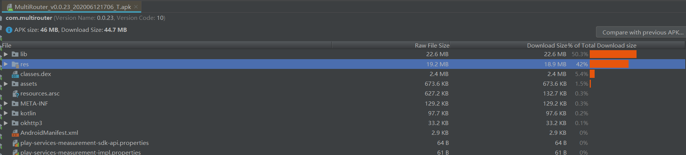

## Android APK包体积优化总结
>背景：之前有写一篇关于AAB（Android App Bundle）的打包详解，是Google官方推出的编译及发布APK机制，但也仅是适用于Google Play。对于国内的应用市场，还是只能在APK包体积优化上下功夫，因此记录一下关于APK包体积优化的资料查找记录及实践。先上一张APK Analyze结果：  
  

>APK包体积优化之图片优化：  
&emsp;&emsp;APK包体积优化首先想到的当然是静态资源优化，自然少不了图片优化。图片优化可以从以下几个方面入手：  
&emsp;&emsp;1.查找并清除未使用的图片资源  
&emsp;&emsp;通过Android Studio导航栏-->Analyze-->Inspect Code...来分析APK包，结合分析结果中 `Unused resource`一栏即可找到未被使用的资源列表，可对比查看删除相关无用资源，分析结果如下：  
  
&emsp;&emsp;2.将图片资源格式转换为WebP格式  
&emsp;&emsp;WebP格式图片由Google推出，同等情况下图片质量没差，但体积更小，详情可参考官方链接[WebP格式图片](https://developers.google.com/speed/webp/docs/precompiled)  
&emsp;&emsp;3.使用svg格式图片  
&emsp;&emsp;操作方式如下：`APP文件结构下找某张图片资源，右键new-->vector Asset`  
   

>APK包体积优化之资源打包配置优化(删除不必要的语言配置)：  
&emsp;&emsp;在APK Analyze分析器中在 `resources.arsc` 中找到`string` 选项，可查看到当前的语言支持，在build.gradle中的defaultConfig中添加如下代码： `resconfigs(zh-rCN)`,即可看到`resources.arsc` 文件大小变小。如下图：  
  

>以上就是APK优化总结的两点，此外还包括代码混淆、资源混淆等，毕竟没涉及到原生开发，有待接下来进一步了解添加。

参考链接：
1.https://cloud.tencent.com/developer/article/1466431  
2.https://blog.csdn.net/mynameishuangshuai/article/details/51752832