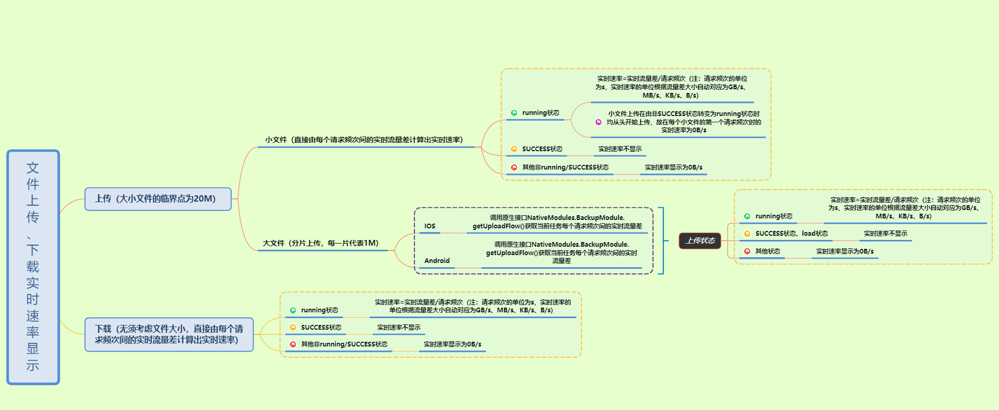

## 文件上传、下载实时速率计算方案整理  

**_目的_**
- 通过整理总结该项目中的实时传输速率的计算方案，查缺补漏，为以后遇到类似问题时提供解决思路，同时不断优化

**_流程图_**
- Xmind

**_遇到的问题_**
- 切换当前传输任务时，进度条先前进然后后退
    - 原因及解决办法：切换传输任务时，未对相应任务的当前实时流量进行持久化存储，导致切换的瞬间出现该问题。根据当前传输的任务ID对传输文件的实时流量进行持久化存储，当切换至指定文件进行传输时，首先获取持久化存储的流量信息用于展示，若没有，则默认为新开启的任务，接下来开始传输后根据服务端返回的最新实时流量来计算当前文件的实时传输速率

- 传输过程中实时速率存在负值
    - 原因及解决办法：在进行分片上传时服务端传输片数出错导致最新实时流量小于本地存储的持久化传输流量。在最终更新渲染当前实时流量时，对实时速率进行判断，若速率值小于0，则显示0B/s来规避服务端出错

