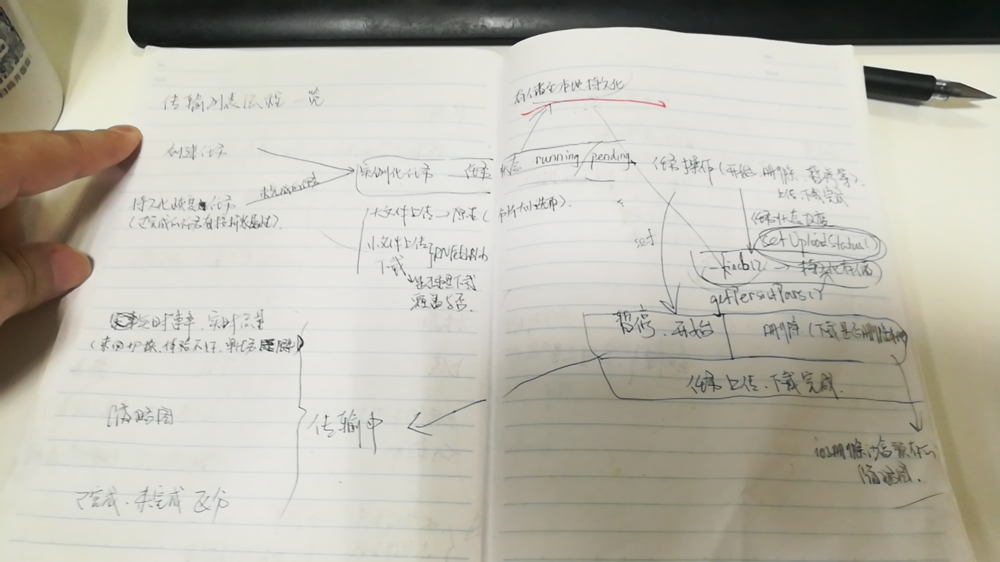

## 文件上传、下载流程梳理回顾  

**_前言_**
  - 趁着这段时间项目周期不是很赶，梳理一下之前一些项目开发上线后一直想整理而没有整理的东西，这便是这篇文章的初衷。Backuper APP项目算是第一次接触RN，现在再回看当时的代码，又是一番感觉，很多地方还是可以有进一步的优化，代码也可以更进一步的规范，组件的编写又或许不会再使用类组件的方式，而是大都用函数组件进行替代，当然了，这些都是后话了，当时第一次写RN的代码还是一脸懵的，由于是在旧版本的基础上进行功能更新，因此很多东西还是得从前任的源码看起。确实，看别人写的代码都是一边看一边心里MMP。。。不过好在还是硬着头皮看了下来，经验就是：`写代码一定要有简单的注释；写代码一定要有简单的注释；写代码一定要有简单的注释；`  

**_正文_**
- (ps:文末配有当时阅读代码时“珍贵的手稿”，那都是活生生掉的头发的见证啊)  
- 涉及概念：  
  - 大小文件临界点：改版过后的大小文件的临界点由原先的1M换成20M（实在没搞懂1M区分的意义在？）  
  - 小文件上传：使用的库为`react-native-fetch-blob` [仓库地址](https://github.com/wkh237/react-native-fetch-blob)、[npm下载地址](https://www.npmjs.com/package/react-native-fetch-blob)  
  - 大文件上传：借助android/ios原生，通过与其交互完成大文件的上传  
  - 文件下载：使用的库同样为`react-native-fetch-blob`  
  - 大文件分片时每片文件的大小选取范围：根据文件大小动态选取分片文件大小，可选值包括：【1M, 2M, 5M, 10M, 15M, 20M】   
  
- 流程：  
  1.上传、下载任务实例化（实例化任务主要有两个来源：一是新增的上传、下载任务；二是从持久化存储里面恢复的上传、下载任务），  
    2.由于是只能进行单任务上传、下载，因此根据持久化数据的信息来选取一个新任务进行传输，其他任务状态自动变为“等待中”；在上传文件时，首先判断当前上传的文件是否需要进行分片  
    任务状态变化  
    &emsp;&emsp;- 暂停：当前任务状态变为暂停后，则自动轮询当前任务列表查看是否存在等待中的任务，若有，则按顺序选取一个任务继续传输。同时对这两个状态变化的任务对象进行持久化存储数据更新  
&emsp;&emsp;- 删除：若删除当前正在进行传输的文件，和暂停相同，同样需要进行持久化存储数据的更新，同时更新任务列表  
&emsp;&emsp;- 上传完成：小文件上传完成后直接更新持久化数据状态即可，另外可根据需要判断是否需通知服务端当前任务已传输完成；大文件上传完成后，需通知服务端进行临时文件合并操作，之后便不断轮询文件合并结果，合并完成后更新持久化数据状态，同时通知服务端删除临时存放的分片文件资源；  
&emsp;&emsp;- 下载完成：文件下载完成后更新当前文件对象的持久化存储数据，同时通过原生接口更新下载完成的文件信息  

- 注意事项：  
  - ios缩略图处理：文件传输完成后需调用IOS原生接口删除沙盒目录下临时生成的缩略图  
  - 传输任务ID的生成：（通过随机数生成）  
      
    Math.random().toString(36).substring(2)
  - 网络变化处理：监听当前网络变化（WiFi-->流量；流量-->WiFi），作相应提示  
  - 在下载一个文件时先判断本地相应目录下是否已存在该文件，若存在，则执行“假下载”。此外，借助`react-native-fetch-blob`执行下载时，通过在实例化任务的then方法中判断读取本地是否存在该文件来标识下载成功与否，同时借助原生方法更新本地文件  
  - 所有涉及到传输任务对象变化的动作均需将对应的持久化存储数据进行更新  

- 以上只是针对整个上传、下载流程做了一个简单的梳理，详细编写代码过程中还会涉及到方方面面的情况处理与分析  
- 手稿：

 
