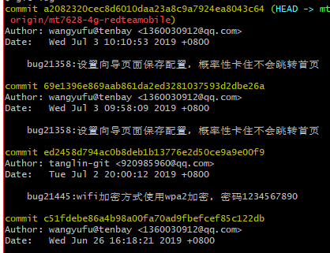
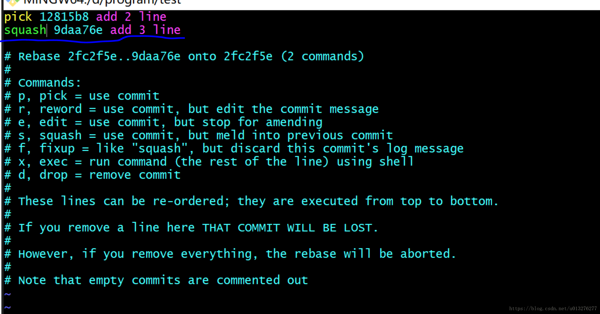

## 问题点
## 1.将多个已push的commit合并为一个commit

>目的：将上图中的两次bug21358提交记录合并为一次

>操作步骤一：

    git rebase -i  commid-id     
    // 这里的commit-id为所需合并的几次commit-id后需跟在的commit后面的id，因此这里的id值为bug21445这次提交所对应的commit-id值。
    // -i表示不需要合并的commit的hash值，这里即指的是ed2458d794ac0b8deb1b13776e2d50ce9a9e00f9
    // 执行上述命令后即进入vi模式，点击i即可进入编辑模式
    // 将需要修改的合并的commit前面的pick改为s(或者squash),修改完成之后敲击esc,然后英文版的:,输入wq即可完成保存
 

>操作步骤二：

    //执行完上述操作之后就会跳转进入commit message merge界面,删除其中一个或几个需要删除的commit信息，保留或修改至预期的commit信息。完成后，同样执行敲击esc,然后英文版的:,输入wq命令即可
    git log    //再执行就可以看到本地提交记录已经修改合并成功
    git push -f origin branch_name   //最后执行此操作就可将本地合并commit的修改同步至远程

## 2.修改commit注释
>情景一：需修改的commit还未push

    /*修改最新一次提交注释*/
    git commit --amend
    之后通过点击i进去编辑模式，编辑完成之后，点击esc退出编辑模式，最后通过:wq命令完成编辑

    /*修改某一次提交的注释*/
    git rebase -i HEAD~2      //显示倒数两次的注释，第一行即为倒数第二次的commit注释
    点击i进入编辑模式，将需要修改的commit注释信息前面pick修改为edit，然后将注释做对应修改，点击esc退出编辑模式，最后通过:wq命令完成编辑
    git commit --amend
    git rebase --continue

    /*同理，修改几次提交的注释*/
    //同上面的修改某一次提交额注释一样，只只不过需要将多个commit前面的pick改为edit即可，其他操作步骤相同

>情景二：需修改的commit已提交至远程仓库

    //先执行git pull操作获取远程的最新代码，然后按照上面相同的步骤修改某一次或者某几次的commit注释信息，在所有步骤都完成之后，通过：
    git push --force origin master         //强制push到远程仓库

    注意事项：在执行此操作期间，一定确保无其他人正在push代码到该远程分支，否则会被覆盖掉

参考资料连接：  
https://www.jianshu.com/p/098d85a58bf1

## 3.为何执行push操作时每次都需要输入用户名和密码
>问题：每次push代码到远程仓库时都需要输入用户名和密码

>原因：在第一次添加/克隆远程仓库的时候选择的是以https的方式进行，从而导致每次push到远程仓库时都以https的方式进行传输。

    git remote -v 可用于查看当前使用的传输协议

>解决方案：

    git remote rm origin
    git remote add origin 【使用ssh方式时的传输地址，如git@gitlab.com:TenbayCustom/GateWay/UniPoE-web/openwrt-ac-puppies.git】
    git push -u origin master

    注：（重新设置完毕之后再次执行 git remote -v 即可看到传输方式已经变成ssh协议方式）

## Git命令
    git init         --将当前目录转变成git可以管理的仓库，这是在当前目录会生成一个.git文件夹，用于跟踪管理当前git版本库。该文件夹默认隐藏，可通过 ls -ah 来查看
    git add <file>   --可添加多次,将文件放至暂存区stage
    git commit -m "备注信息"    --一次性将暂存区的全部修改提交至分支 
    git status       --输出当前仓库的状态
    git diff         --查看文件修改的详细信息
    git log          --查看从最近到最远的提交记录历史，可用于回退到之前的版本，其中HEAD表示当前版本，HEAD^表示上一个版本，HEAD^^表示上上个版本，前100个版本可用HEAD~100表示
        输入法为英文状态时，按住q即可退出 git log
    git reset --hard HEAD^       --表示回退到上一个版本，【--hard参数意义？】若在回退到上一个版本之后想返回，前提是命令行窗口未关闭，则可通过   git reset -hard a12s5  [其中“a12s5”为commit-id],commit-id 不用全部写全，但是必须可以通过写出的ID找到唯一的一个版本。
    git reflog       --查看命令历史，可用于回退到未来的版本
                    没有被添加到暂存区的文件的状态是 untracked
    git checkout -- readme.txt   --将文件在工作区的修改全部撤销【git checkout -- file】
    git reset HEAD file    --将已经添加到暂存区的修改撤销，HEAD表示最新的版本
    git rm file   --删除指定文件，若误删了文件，可用 git checkout -- file 进行恢复，该命令实际就是用版本库里面的版本替换工作区的版本，无论是删除还是修改，都可以用此命令一键还原。
    使用ssh-keygen -t rsa -C "youremail@example.com" 创建ssh key,将.ssh目录下面的id_rsa.pub文件里面的内容复制到githu或者gitlab上setting里面的SSH配置项中
    git push -u origin master    --将本地master分支的内容推送到远程库，-u参数会将本地分支和远程分支关联起来，一般会在第一次推送时使用，方便之后的推送和拉取命令，之后就可以通过git push origin master将本地库的修改推送至远程。若push失败，则是由于远程分支比本地更新，需通过git pull进行合并，若合并有冲突，则先解决冲突然后在进行git pull合并；若运行git pull提示 no tracking information ,则需要通过
    命令：git branch --set-upstream-to branchname origin/branchname  建立本地分支与远程分支之间的链接关系   
    git remote -v    --查看远程仓库的信息
    git remote add origin git@server-name:path/repo-name.git    --关联远程仓库，关联后就可使用git push 来推送本地库修改到远程库【先有本地库，再有远程库的情况】
    git clone URL    --克隆远程仓库，URL有两种性形式：【1、git@github.com:michaelliao/gitskills.git  2、https://github.com/FerrisYufuWang/DailyReport.git ，git协议相对传输速度更快】
    git checkout -b newbranch      --创建并切换至newbranch分支，该命令等同于：【git branch newbranch、git checkout newbranch】
    git branch                              --查看当前分支
    git branch newbranch                    --创建分支
    git checkout newbranch                  --切换分支
    git merge newbranch                     --将指定的newbranch分支合并到当前分支，合并存在几种模式，其中“Fast-forward”为“快进模式”，直接将当前分支指向newbranch的当前提交
    git branch -d newbranch                 --删除newbranch分支
    git log --graph                         --查看分支合并图
    git merge --no-ff newbranch -m 'merge with no-ff'    --使用普通模式而非“Fast-forward”模式进行合并，避免删除该分支后无法查看分支历史信息，合并后可通过git log 查看分支历史记录。
    git stash     --将当前分支工作内容隐藏起来，之后就可以新建分支或者切换至其他分支处理其它问题处理完成之后，回到当前分支，通过git stash list 可查看之前的工作内容，通过git stash pop可以恢复之前的工作内容，同时删除stash里面的内容；也可通过git stash apply 先恢复工作内容，然后通过git stash drop删除stash里面的内容；
    通过git stash list命令返回的内容，可指定git stash apply stash@{0}恢复到指定的stash。git stash clear 清除所有stash里面的内容；git stash drop stash@{i} 清除指定stash list里面的内容
    git branch -D branchname               --强行删除未被合并的分支
    git tag                                --查看所有标签
    git tag tagname                        --给最新的commit打标签
    git tag tagname commitID               --给指定的commit打标签
    git tag -a tagname -m '说明'           --给指定的tag添加说明文字，-a后面接指定的标签名
    git show tagname                       --查看指定标签的说明文字

