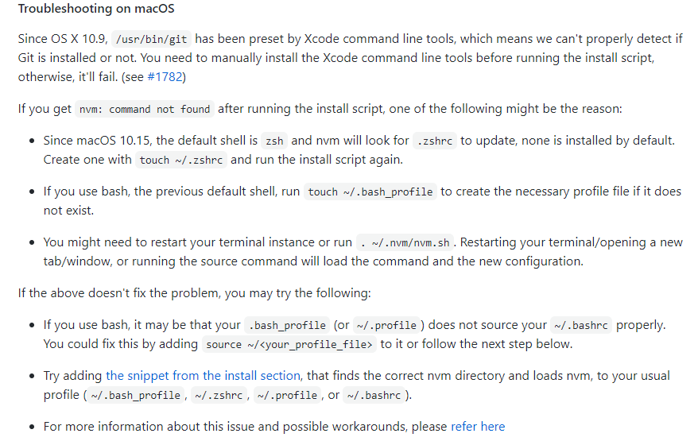
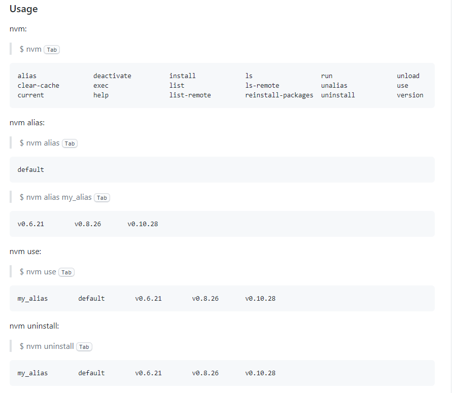

## nvm的安装与使用

>定义：  
&emsp;&emsp;nvm（node version management--node版本管理工具），用于方便快捷的切换node版本  

&emsp;安装步骤：  
&emsp;1.清空当前已安装的node版本（清除多余的node环境，方便使用nvm统一管理，避免出现冲突）；具体清空步骤/命令如下：  

    sudo npm uninstall npm -g
    sudo rm -rf /usr/local/lib/node /usr/local/lib/node_modules /var/db/receipts/org.nodejs.*
    sudo rm -rf /usr/local/include/node /Users/$USER/.npm
    sudo rm /usr/local/bin/node
    sudo rm /usr/local/share/man/man1/node.1
    sudo rm /usr/local/lib/dtrace/node.d
    //执行以下命令检查是否删除完毕
    node
    npm  
&emsp;2.安装命令：

    curl -o- https://raw.githubusercontent.com/nvm-sh/nvm/v0.35.3/install.sh | bash
    //or
    wget -qO- https://raw.githubusercontent.com/nvm-sh/nvm/v0.35.3/install.sh | bash  
&emsp;3.检查nvm版本及验证是否安装成功：

    command  -v nvm
    //or
    nvm

&emsp;nvm相关操作命令：

    nvm install node       //安装最新版本
    nvm install stable     //安装最新稳定版node
    nvm install <version>  //安装指定版本的node
    nvm uninstall <version>       //卸载指定的版本，若卸载的版本为当前所用版本，则需先解绑
    nvm deactivate         //解除当前版本绑定
    nvm use <version>      //切换使用指定的node版本
    nvm current            //显示当前使用的版本
    nvm ls                 //列出所有安装的版本
    nvm ls-remote          //列出官网上所有的Node版本
    nvm alias <name> <version>    //给不同的版本号添加别名
    nvm unalias <name>    //删除已定义的别名
    nvm alias default <version>   //指定默认版本（设定后需打开新的终端才生效）
    //执行nvm可查看更多的nvm相关命令
&emsp;其他：  
&emsp;· 所有不同版本的node都将会被安装在【~/.nvm/version/node】目录下；若需下载nvm，则只需将整个.nvm文件夹删除即可  
&emsp;· 在mac上安装可能会遇到的问题及解决方案：  

 
&emsp;命令参考：  

 
&emsp;&emsp;  
参考链接：  
1.[MAC版本nvm的安装与使用](https://segmentfault.com/a/1190000017881215)  
2.[删除node相关命令](https://www.jianshu.com/p/920961b6a538)   
3.[官方仓库及安装教程、使用文档](https://github.com/nvm-sh/nvm)   
4.[官网](http://www.nvmusa.org/) 