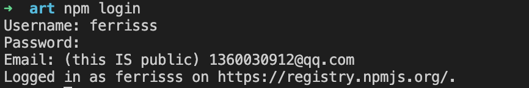
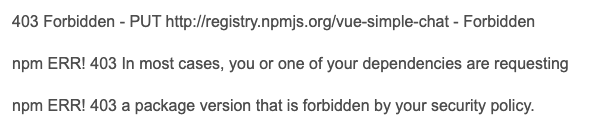
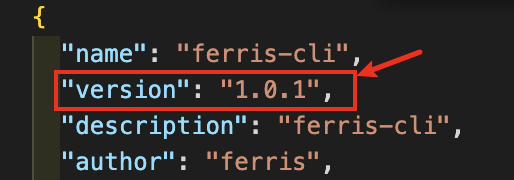

## npm package的发布及踩坑记录
&emsp;&emsp;  

    1.账号注册  
        npm adduser  
        (根据提示依次输入用户名、密码、邮箱;若用户名已被注册，则会提示：Unable to authenticate, need: Basic,可尝试使用其他用户名进行注册)  
    2.账号登录  
        npm login  
        (使用步骤1注册时所用的用户名、密码、邮箱即可登录成功,登录成功如下图所示: )  

    3.package发布  
        进入到待发布的包的根目录下，执行【npm publish】,若发布成功则会输出如下格式log:  
        +package_name@version  
        若出现如下图所示错误，则说明已注册账号的邮箱处于未激活状态，查看在进行步骤一注册后邮箱是否收到关于npm激活的邮件，有则按照提示进行激活，若没有则可借助账号密码登录npm官网(https://www.npmjs.com/),网页顶部会有相应邮箱激活提示  
  

    4.package更新  
        进入待更新的包的根目录下，执行【npm version patch】,查看根目录下的package.json文件会发现version自动增加了一个小版本号,如下图，版本号由1.0.0变成1.0.1,接着执行【npm publish】前提是已登录,若更新成功会输出log:  
        +package_name@new_version,此时在npm官网则可看到对应包的version版本新增了  
 

    5.package删除  
        a.删除指定版本的包  
            npm unpublish package_name@specify_version  
            若删除成功则会有如下提示log:  
            -package_name@version  
        b.删除整个包  
            npm unpublish package_name --force     
            若删除成功则会有如下提示log:  
            -package_name  

&emsp;&emsp;  
参考链接：  
1.[npm官方command手册](https://docs.npmjs.com/cli/v6/commands)  
2.[发布命令相关](https://blog.csdn.net/taoerchun/article/details/82531549)   
3.[发布报错一](https://blog.csdn.net/outlierqiqi/article/details/110136991)   
4.[发布报错二](https://blog.csdn.net/qq_41648452/article/details/108983467)   
5.[发布报错三](https://zhuanlan.zhihu.com/p/84845701) 