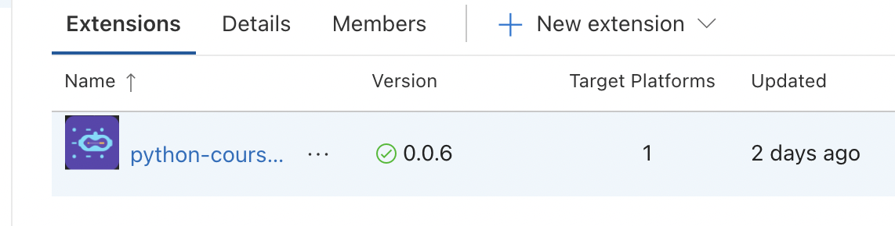

# vscode插件开发回顾总结
**_前言_**  
- 前后断断续续花费了大概快两个星期的时间，终于完成了课程配套vscode插件的MVP版本，算是从vscode插件开发小白晋升到了菜鸟，过程中有很多踩坑的经历，记录一下就当是这次的一个总结吧（本文仅适用于踩坑求解），vscode插件开发的系列文章教程网上也有一些，这里就不重复了。 接下来就直奔主题啦～   
- 开发的插件:
 

**_踩坑实录_**  
1.网页端拉起vscode并激活插件时获取到的uri协议路径不对  
```javascript
    //若想通过网页端拉起vscode并激活指定插件，则拉起链接应当符合以下格式:
    ` vscode://[publisherName].[pluginName]/your-url?aaa=xxx&bbb=xxx... `
    // 如：vscode://bellcodedev.python-course-plugin/diy?a=1&b=2
    // 因此，若想成功激活vscode插件，则在插件的package.json文件中一定要配置publisher字段
```
2.无法获取插件启动页html文件  
```javascript
    // 在vscode插件入口js文件中若想加载指定的html文件作为插件的webview启动页时，加载的本地html资源路径需以插件全局上下文对象的扩展路径 + html文件的相对路径，格式如下: 
    const resourcePath = path.join(context.extensionPath, templatePath);
    // 如: const resourcePath = path.join(context.extensionPath, 'src/view/index.html');
```
3.自定义webview启动页内无法调用vscode相关操作  
```javascript
    // 相比普通的浏览器网页，vscode插件内的webview页面内独有一个acquireVscodeApi()方法，可用于调用vscode相关操作
    // 如在webview引入的js文件中，可在顶部加入如下代码即可使用vscode在webview中提供的方法:
    const vscodeApi = acquireVscodeApi();
    vscodeApi.xxx
```
4.webview页面与vscode插件之间的通信  
```javascript
    // 紧接上一坑，在拿到vscodeApi后，即可实现webview同vscode插件之间的消息通信
    // 1.webview向插件发送消息，在webview中通过vscodeApi.postMessage(),如:
    vscodeApi.postMessage({ type: 'init', value: { ...params } });    // 传输的对象格式可自定义，满足自己的需求即可
    // 2.在webview中监听来自插件的消息
    window.addEventListener('message', handler);
    handler = message => {
        const { type, value } = message;
        switch (type) {
            case 'init':
                //...
                break;
            case 'complete':
                //...
                break;
            default:
                //...
        }
    }
   // 3.在插件中向webview发送消息
   const webviewPanel = vscode.window.createWebviewPanel(
       'study_ststem',  // 标识类型
       '学习系统'， // webview的头标题
       vscode.ViewColumn.one,   //创建并显示webview时该webview的显示位置
       {
           enableAcripts: true,  //是否启动JS
           retainContextWhenHidden: true,   //设置此项可在当前webview转为背景选项卡（即未聚焦）时不销毁当前webview，避免再次显示时重新渲染(但设置为true时会有一定的性能影响)
           //...    其他配置项
       }
   )
   webviewPanel.webview.postMessage({ type: 'showInit', value: { ...params }});
   // 4.插件接收来自webview发送的消息
   webviewPanel.webview.onDidReceiveMessage( message => {
       webviewMessageHandler(message);  //自定义webviewMessageHandler函数处理消息
   })
    
```
5.webview页面的头部icon显示  
```javascript
    // icon资源的加载:
    welcomePanel.iconPath = Uri.file(path.join(context.extensionPath, 'images/webview-icon-path.png'));
```
6.webview页面的头部icon显示  
```javascript
    // icon资源的加载:
    welcomePanel.iconPath = Uri.file(path.join(context.extensionPath, 'images/webview-icon-path.png'));
```
7.开发过程中数据持久化存储
```javascript
    // vscode插件的全局上下文context对象有提供一个globalState对象，可通过该对象的get/update方法来获取和存储想持久化的数据哦，如下示例:
    const userName = context.globalState.get(USER_NAME, '');
    context.globalState.update(USER_NAME, 'ferris');
```
8.vscode StatusBar按钮icon自定义问题
```javascript
    // vscode插件开发过程中，若想在vscode底部工具栏加上自己插件的操作按钮，则可通过注册一个StatusBarItem来实现，但目前还无法实现给Item添加自定义icon图标，仅能使用官方提供的icon（官方仓库的issue也有人反馈，可能还没提上议程吧。。。相关issue可见：https://github.com/microsoft/vscode/issues/72244），因此目前还是只能使用官方提供的icon具体用法如下:
    const statusBarButton = vscode.window.createStatusBarItem(vscode.StatusBarAlignmet.Left, 100);
    // 此处的按钮格式：  按钮文本 + 官方提供的icon名，可选icon的链接：https://code.visualstudio.com/api/references/icons-in-labels#icon-listing
    statusBarButtom.text = `[buttontext] $(arrow-up)}`;
```
9.开发vscode插件相关操作命令
```javascript
    npm install -g yo generator-code    //安装官方脚手架工具
    yo code         //借助官方脚手架生成hello world项目
    npm i vsce -g   //开发打包并发布至插件市场都必须安装的工具
    vsce package    //本地打包生成插件的vsix文件，可用于本地上传发布或直接分享给他人直接本地安装插件
    vsce publish    //直接打包发布至vscode插件应用市场
    vsce publish patch  //发布至插件应用市场并自动递增版本号
    vsce ls-publishers  //查看本地当前插件开发者
    vsce login      //登陆指定的插件开发者账号
    ...
```

**_后记_**  
- 当然啦，肯定还有很多坑是我没遇到的，毕竟，坑是踩不完的，且踩且珍惜～开发过程中遇到任何问题，首先应当想到的是从官方文档中去找解决方案，官方文档始终是最权威的，其次就是官方对应的仓库issue啦，相关链接已经贴在文末啦。以上就是这次vscode插件开发的一个小小结～


参考链接：  
[vscode插件开发官方文档](https://code.visualstudio.com/api)   
[vscode官网issue](https://github.com/microsoft/vscode/issues)   
