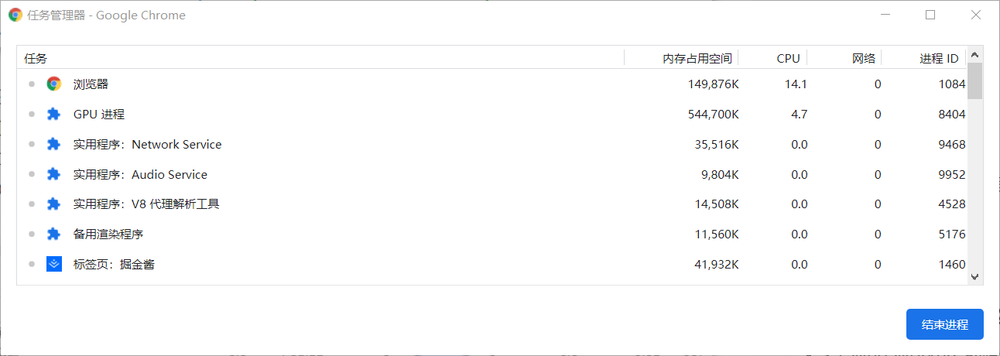
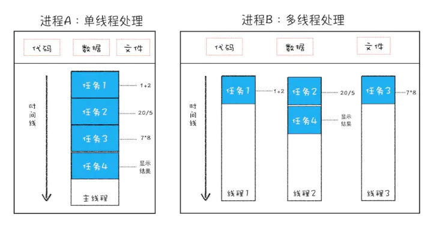
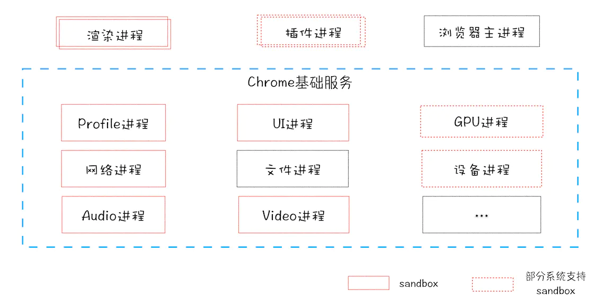

#### 前前前言
由于个人水平有限，系列文章仅为个人见解，如存在错误或有疑问的地方，欢迎指出并探讨。

#### 前前言
浏览器作为日常web开发工作中接触的最多的一个工具，不管是页面渲染效果实时预览还是debug调试，我们时时刻刻都在与之打交道，可以说，作为一名FEer，除了IDE，就是浏览器了。接下来我将尝试着通过一个系列的文章来同大家一起学习、探讨我们的浏览器。浏览器的种类有很多，从刀耕火种时代的IE，到今天的Firefox、Opera、Safari、Chrome等，鉴于目前公司的项目主要考虑Chrome用户（这算是给前端的同学解决了一个兼容性的大麻烦。。。），因此，接下来关于浏览器的介绍主要指的是Chrome浏览器，不排除会简单介绍一下其他的浏览器。个人电脑的Chrome浏览器版本为：【**85.0.4183.121**】

## 浏览器的进程(process)与线程(thread)--理论篇

####     前言  
这次主要想和大家一起聊一聊的是**浏览器的进程与线程**。何谓'进程'，即CPU资源分配的最小单位；何谓'线程',即CPU调度的最小单位。概念介绍完毕，接下来将通过图文并茂的方式向大家详细的介绍他们。  

####   何谓'进程'？何谓'线程'？
&nbsp;&nbsp;&nbsp;&nbsp;&nbsp;&nbsp;首先，运行我们的Chrome浏览器，打开一个页面，如'掘金酱'，接着，点击浏览器右上角'面包屑'样式的菜单按钮，找到'更多工具'-->'任务管理器'。如图，从图中可以看到有：  
    
    
    

实例 | 代表进程
---|---
浏览器 | 浏览器主进程
GPU进程 | GPU进程
实用程序：Network Service | 网络进程
实用程序：V8代理解析工具 | 插件进程
渲染进程 | 标签页：掘金酱
    
**浏览器主进程**：顾名思义，即浏览器的主进程，浏览器在运行时只有一个主进程。它主要负责tab标签页的管理，浏览器界面的显示，用户的交互以及其他进程的创建于销毁。  
**GPU进程**：主要用浏览器界面的3D绘制，同样在浏览器中只有一个（小渊源：据资料查证，Chrome最开始发布时并无GPU进程，使用GPU的初衷是为了实现3D CSS效果，之后鉴于浏览器的UI界面均采用GPU绘制，使得Chrome在最终的多进程架构设计上引入了GPU进程）。  
**网络进程**：负责tab页面的网络资源的加载。该进程在2016年Chrome官方团队于“面向服务的架构-SOA”中独立出来，原本属于浏览器的主进程的一部分，在浏览器中只存在一个网络进程。  
**插件进程**：在浏览网页需要使用某个插件的时候会创建，每个类型的插件对应一个进程。因此插件进程存在多个。  
**==渲染进程==**：渲染进程即浏览器的内核。主要负责页面渲染、脚本执行、事件处理等。每个tab页面都对应着一个渲染进程，彼此之间互不影响。渲染进程在浏览器中同样可以存在多个。  

&nbsp;&nbsp;&nbsp;&nbsp;&nbsp;&nbsp;其次，我们再来了解一下线程，上面说了线程是CPU调度的最小单位，即线程是建立在进程的基础之上的程序中的一个执行流。一个进程中若只有一个执行流，称之为单线程；若存在多个执行流，则称之为多线程。以上，我们知道了，进程与线程之间的关系是：**==进程里面包含线程，线程是进程的一部分==**

#### 渲染进程
&nbsp;&nbsp;&nbsp;&nbsp;&nbsp;&nbsp;· **页面渲染、脚本执行、事件处理等**均是在渲染进程中进行的  
&nbsp;&nbsp;&nbsp;&nbsp;&nbsp;&nbsp;· **渲染进程是多线程的**，包括五个线程：分别是**GUI渲染线程、JS引擎线程、事件触发线程、定时器触发线程、异步HTTP请求线程**  
&nbsp;&nbsp;&nbsp;&nbsp;&nbsp;&nbsp;· **GUI渲染线程与JS引擎线程是互斥的，同一时段只能有其中一个线程在执行**（在主流浏览器中，一帧的刷新频率为60Hz，即大概16.6ms浏览器刷新一次，每一帧内都会去执行JS脚本和浏览器样式的布局和绘制，两者互斥，交替执行。在最新的react v16架构中，Fiber即虚拟DOM的特性：异步可中断的更新，在Scheduler和Reconciler阶段会被中断执行的原因之一同样是由于当前帧中没有剩余时间，由于JS脚本的执行和浏览器页面的绘制互斥，导致两者只能交替执行）

#### 进程与线程的区别
1. 一个进程可由一个或多个线程组成
2. 进程之间相互独立，同一进程下的各个线程之间共享进程的内存空间及进程级资源
3. 相比进程，线程上下文的切换会更快  

#### 多进程与多线程 
&nbsp;&nbsp;&nbsp;&nbsp;&nbsp;&nbsp;**多进程**：同一时间内系统内存在两个及以上的进程处于运行状态，如此时此刻的网易云音乐和vs code  
&nbsp;&nbsp;&nbsp;&nbsp;&nbsp;&nbsp;**多线程**：即一个进程内存在多个执行流在同时分别执行不同的任务  

#### JS是单线程执行的
&nbsp;&nbsp;&nbsp;&nbsp;&nbsp;&nbsp;JS在作为一个脚本语言，在web前端领域主要用于处理用户交互及DOM操作，基于此，其只能是单线程的，否则，若同时存在多个线程操作一个DOM或同时执行某个动作，将会产生无法预知的结果。此外，H5中WebWorker的出现并没有改变JS是单线程的本质，它的出现只是为了提升多核CPU的计算能力，允许JS创建多个子线程，但子线程完全受控于主线程，且子线程不能操作DOM
    
#### 为什么现代浏览器是多进程的
    
&nbsp;&nbsp;&nbsp;&nbsp;&nbsp;&nbsp;在很久很久以前，据史料记载，在IE浏览器在市场上还占据主导地位时，当时的ie6，就是一个单进程的浏览器，通过上面的学习我们知道，若一个浏览器是单进程的，一旦某个网页由于不具名的原因崩溃之外，会直接导致整个浏览器崩溃，此外，在获取网络资源及执行脚本时，若资源加载较慢或脚本本身存在死循环，则会使得所有页面都在等待资源加载完毕或脚本执行完毕，严重影响用户体验，由此可以知道，单进程浏览器存在不稳定、用户体验差等问题。浏览器多进程时代到来以后，**浏览器主进程即（Browser进程）负责整个浏览器的调度，单个tab页面由对应的渲染进程处理，网络资源由网络进程统一处理，需要使用插件时生成对应的插件进程，分工合作，确保单个页面的崩溃或某个插件进程的崩溃不会影响整个浏览器的使用**，有效解决了单进程浏览器的问题。

#### Chrome面向服务的架构--SOA
  

参考链接：  
1.[Chromium多进程模型](https://www.chromium.org/developers/design-documents/process-models)  
2.[Chromium关于多进程架构的解答](https://blog.chromium.org/2008/09/multi-process-architecture.html)  
3.[单进程与多进程](https://www.zhihu.com/question/368712837/answer/999401453)  

**下一篇：浏览器的本地存储及缓存机制**
